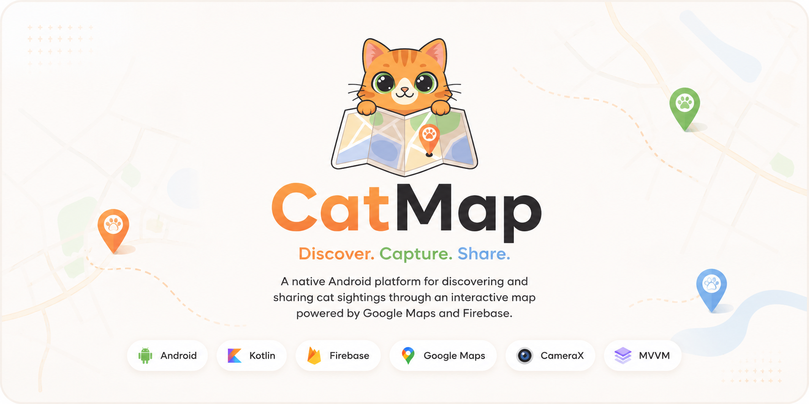
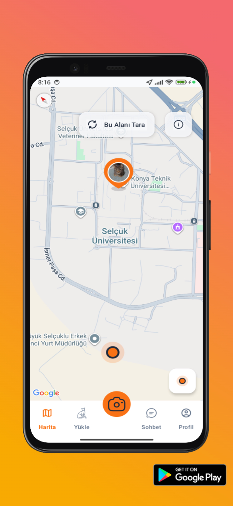
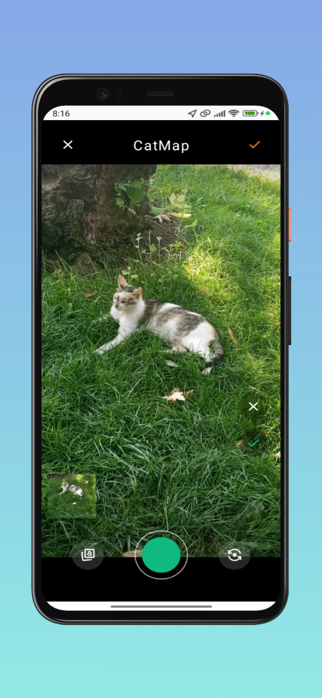
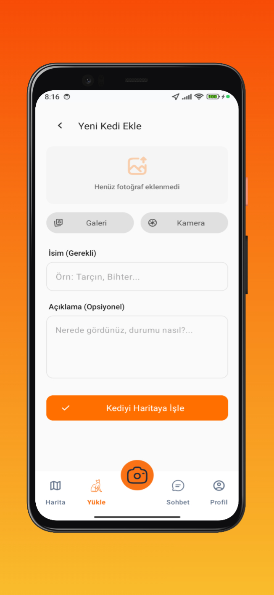
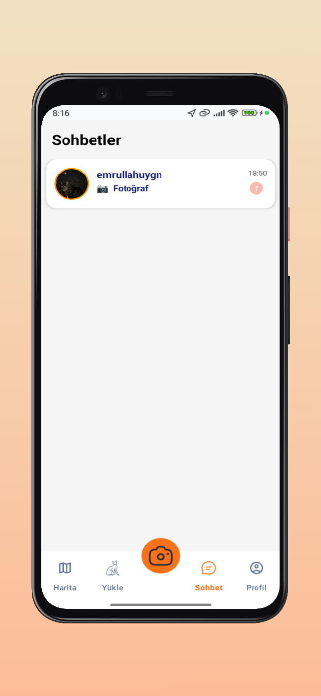
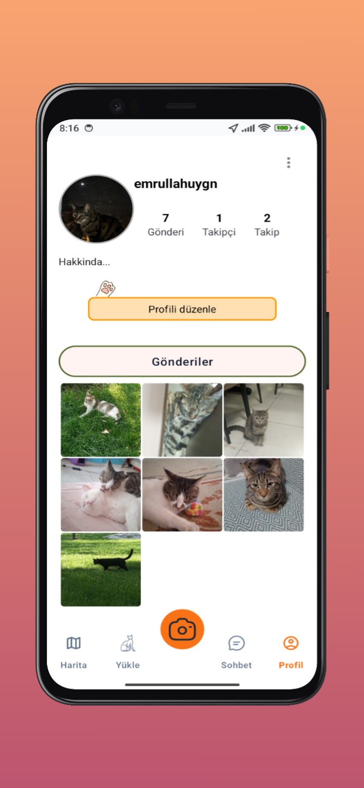
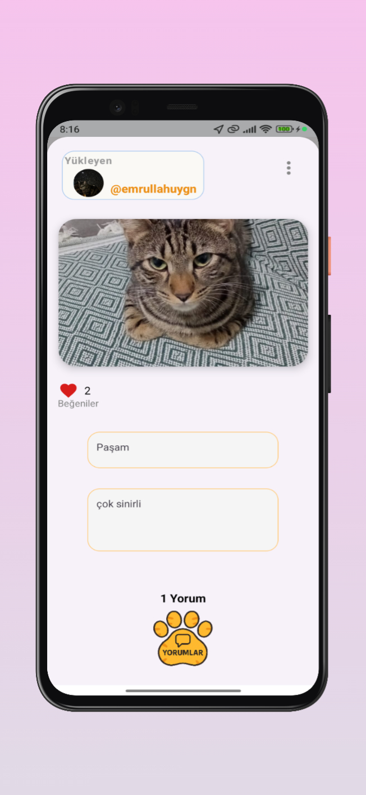

<p align="center">
  
</p>

<h1 align="center">CatMap</h1>

<p align="center">
  <strong>Where Every Cat Finds Its Place.</strong>
</p>

<p align="center">
  An open-source Android application for discovering, photographing, and sharing cats on an interactive map.
</p>

<p align="center">
Discover nearby cats • Capture memorable moments • Share with the community
</p>

<p align="center">
Android • Firebase • Google Maps • CameraX • MVVM
</p>


<p align="center">


</p>

---

## Table of Contents

- [Overview](#overview)
- [Why CatMap?](#why-catmap)
- [Features](#features)
- [Technology Stack](#technology-stack)
- [Application Preview](#application-preview)
- [Architecture](#architecture)
- [Project Structure](#project-structure)
- [Getting Started](#getting-started)
- [Engineering Highlights](#engineering-highlights)
- [Roadmap](#roadmap)
- [Contributors](#contributors)
- [License](#license)

---

## Overview

CatMap is an open-source Android platform built for cat lovers who want to discover, document, and share cats through an interactive map.

Instead of leaving memorable encounters as forgotten photos in a gallery, CatMap turns each sighting into a location-aware community post.

The application combines Google Maps, CameraX, Firebase Authentication, Cloud Firestore, Firebase Storage, and a real-time messaging system to create a social experience centered around location and photography.

The project follows the MVVM architectural pattern and focuses on maintainability, modularity, and modern Android development practices.

## Why CatMap?

Every day, countless cats are encountered in streets, campuses, neighborhoods, and parks. Most of these encounters disappear as isolated photos stored on personal devices.

CatMap transforms these moments into a shared community experience.

By combining location services, photography, and social interaction, the application allows every cat sighting to become part of a collaborative map maintained by the community.

Instead of asking:

> "I saw a cat today."

CatMap allows users to say:

> "I shared its story with everyone."


## Features

CatMap brings together interactive mapping, mobile photography, real-time communication and cloud services into a single Android application designed for cat lovers.

| Feature             | Description                                                        |
| ------------------- | ------------------------------------------------------------------ |
| **Authentication**  | User registration, login and password recovery.                    |
| **Interactive Map** | Explore nearby cats using Google Maps and GeoFire.                 |
| **Photography**     | Capture and upload photos with CameraX.                            |
| **Community**       | Profiles, comments, follows and cat posts.                         |
| **Realtime Chat**   | Instant one-to-one messaging.                                      |
| **Cloud Backend**   | Firebase Authentication, Firestore, Storage and Realtime Database. |


## Technology Stack

| Category | Technology |
|-----------|------------|
| Language | Kotlin + Java |
| UI | XML |
| Architecture | MVVM |
| Backend | Firebase |
| Database | Firestore |
| Storage | Firebase Storage |
| Authentication | Firebase Auth |
| Maps | Google Maps SDK |
| Camera | CameraX |
| Async | Coroutines |
| Build | Gradle KTS |
| Min SDK | 24 |
| Target SDK | 34 |

CatMap is built using modern Android development tools with a strong focus on scalability, maintainability and modular architecture.

## Application Preview

CatMap is designed around a simple user journey.

Discover nearby cats.

Capture memorable moments.

Share them with the community.

---

| <p align="center">Discover</p> | <p align="center">Capture</p> |
|-----------|----------|
| <p align="center"></p> | <p align="center"></p> |

| <p align="center">Share</p> | <p align="center">Connect</p> |
|---------|---------|
| <p align="center"></p> | <p align="center"></p> |

| <p align="center">Profile</p> | <p align="center">Details</p> |
|-----------|----------|
| <p align="center"></p> | <p align="center"></p> |

---

## Project Structure

The project is organized into feature-based modules and shared infrastructure layers to improve maintainability and scalability.

```text
app
├── auth/                # User authentication
├── maps/                # Google Maps & location features
├── chat/                # Realtime messaging
├── profile/             # User profiles and social features
├── models/              # Data models
├── repository/          # Data access layer
├── comments/            # Comments and replies
└── ui/
    ├── camera/          # CameraX implementation
    ├── navigation/      # Navigation engine
    ├── upload/          # Post publishing
    ├── manager/         # Shared managers
    ├── map/             # Map UI components
    └── extensions/      # Kotlin extensions
```

## Architecture

CatMap follows the **MVVM (Model–View–ViewModel)** architectural pattern.

The application separates presentation logic, business logic, and data access into dedicated layers, making the project easier to understand and maintain.

```text
Presentation Layer
        │
        ▼
    ViewModels
        │
        ▼
   Repository Layer
        │
        ├──────── Firebase Authentication
        ├──────── Cloud Firestore
        ├──────── Firebase Storage
        ├──────── Google Maps SDK
        └──────── GeoFire
```

This architecture allows UI components to remain independent from backend implementations while improving scalability and code organization.


## Roadmap

- [x] Authentication
- [x] Google Maps
- [x] CameraX
- [x] Firebase Storage
- [x] Realtime Chat
- [x] Profile System
- [x] Nearby Cats

### Next Version

- [ ] Jetpack Compose
- [ ] StateFlow
- [ ] Complete Kotlin Migration
- [ ] Improved Navigation Engine
- [ ] Clean Architecture
- [ ] Unit Tests
- [ ] Dark Theme


## Contributors

| Name | Role |
|------|------|
| **Beyza Nur Takça** | Lead Android Developer |
| **Emrullah Uygun** | Android Developer |

---

<p align="center">

Built with Kotlin, Java, Firebase and ❤️ for the cat community.

</p>